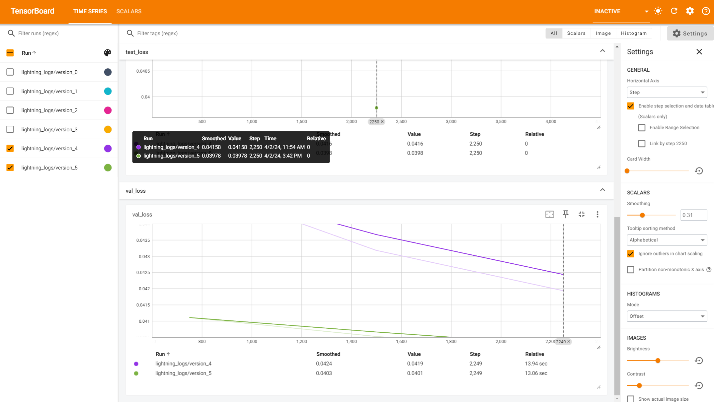

# SAVING AND LOADING CHECKPOINTS (BASIC)

## Saving a checkpoint

```python
trainer = L.Trainer(default_root_dir=os.getcwd())
```

Change the `default_root_dir` to the directory where you want to save the checkpoint.

## Loading a checkpoint

```python
# model
model = LitAutoEncoder(Encoder(), Decoder())
```

we just change this line to:

```python
prev_ckpt = "lightning_logs/version_4/checkpoints/epoch=2-step=2250.ckpt"
model = LitAutoEncoder.load_from_checkpoint(prev_ckpt, encoder=Encoder(), decoder=Decoder())
```

## Visualizing the training process

If you also use `VSCode` and `Remote Explorer` like me, you can visualize the training process by 

- opening the `tensorboard` in the vscode simple browser(you can open it by click `PORTS` forwarded address ).
- or <kbd>Ctrl</kbd> + <kbd>Shift</kbd> + <kbd>P</kbd> and click `Python: Launch TensorBoard`



## Refer

- [SAVING AND LOADING CHECKPOINTS (BASIC)](https://lightning.ai/docs/pytorch/stable/common/checkpointing_basic.html#save-a-checkpoint)